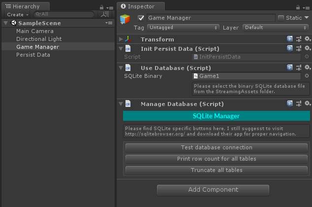

SQLite Manager
==============

[](https://nodesecurity.io/orgs/demo-land/projects/db2b8f79-d51c-40d7-8e27-ce79d590104a)

## :feelsgood: Welcome

**Adopt Database in Unity3D!** ***SQLite Manager*** make easy to read and update your local data. Use a real database to store environment data, player settings, gameplay variables or whatever is in your mind. Query with SQL from simple schema is much easier than manipulate local textfiles for the same reason.

## :rocket: Speed Test

****TODO:**** Everything!

## :warning: Warning

_Under development, the syntax might change in the future. Although I try to make it safe please use it at your own risk, I haven’t used it in production yet._

Tested only with **Unity 2018.1.1f1 for Windows**, *Linux/Mac/Mobile* support is under blockchain kripto’er. (sic)


## :eyes: What Is This

A C# wrapper class around Mono’s SQLite functions to make it easier and faster to use.

## :memo: Simple Example

Find some basic codes with the plugin. Check out the _Tests_ folder for more usage example.

- Init database
```csharp
SQLiteManager db;
try {
    db = new SQLiteManager("Game.db");
} catch (SqliteException e) {
    Debug.Log("Sqlite exception: " + e.Message);
}
```

- Create a class (for examples below)
```csharp
public class User
{
    public int UserID { get; set; }
    public string Name { get; set; }
}
```

- Run native SQL query:
```csharp
using (IDbCommand dbcmd = db.Connection.CreateCommand()) {
    dbcmd.CommandText = "INSERT INTO `User` (`UserId`, `Name`) VALUES (1, 'John Doe'), (2, 'Jane Doe');";
    dbcmd.ExecuteNonQuery();
}
```

- Get one row
```csharp
User user = db.GetObj<User>(1);
User user = db.GetObj<User>("SELECT * FROM User WHERE UserID = 1");
```

- Get multiple rows:
```csharp
List<User> users = db.GetObjList<User>("SELECT * FROM User");
```

## :neckbeard: Example Workflow

We gonna store the database connection variable in a static class, the connection will be always available for a command regardless of the scene. All the steps of this workflow already exist on project _SampleScreen_.

#### :one: Unity Settings

Use creaky C# version. Go to menu ***_File :arrow_right: Build Settings... :arrow_right: Player Settings... :arrow_right: Other Settings :arrow_right: Scripting Runtime Version_*** and set to recent **.NET 4.x Equivalent**.

#### :two: Add Container

To achieve connection container use **[PersistData](https://github.com/SubZtep/PersistData)**. It’s a basic but effective class of mine just handy to store anything in a _HashMap_. Included to this repository.

Create a new empty game object, name it _Persist Data_. In the Inspector window select ***Add Component :arrow_right: Miscellaneous :arrow_right: Persist Data*** for initialising the static class.

#### :three: Create Database

There is no plan to create an enormous database admin inside the Unity editor in the near future by me. It would be pointless. There is plenty of 3rd party software for this job. Just find one you like, install it and get ready to create your game **.db** file. The entire database is in a single file, just think about how simple will be its online synchronisation.

I recommend using **[DB Browser for SQLite](http://sqlitebrowser.org/)** open source desktop app. Very straightforward, create a new database, create the schema and insert potential initial records.

Create or open the **Streaming Assets** folder into your *Assets* directory. Copy here your *Game.db* file.

#### :four: Wake Up Database

Create a new empty game object, name it _Game Manager_. Create _InitPersistData.cs_ script and connect to the SQLite database at the start.

```csharp
if (!PersistData.Instance.Has(PDKey.Database)) {
    SQLiteManager db = null;
    UseDatabase udb = GetComponent<UseDatabase>();

    try {
        db = new SQLiteManager(udb.GetDatabaseFilePath());
    } catch (Exception e) {
        udb.UnselectBinary();
        Debug.LogException(e);
    }

    if (db.IsOpen()) {
        PersistData.Instance.Set(PDKey.Database, db);
    }
}
```

Drop _InitPersistData.cs_ script to the _Game Manager_ Inspector window.

#### :five: Create Helper Class

Create _PD.cs_ script and add a shorter connection access for SQLite.

```csharp
public static SQLiteManager Database() {
    return (SQLiteManager)PersistData.Instance.Get(PDKey.Database);
}
```

Drop _PD.cs_ script to the _Game Manager_ Inspector window.

#### :six: Additional Component

If you'd like to test the connection or get disappointed of lack of functions just simply add ***Add Component :arrow_right: SQLite Manager :arrow_right: Manage Database***. This component has a chance to become big.

#### :hash: Ready To Use

At this point, your database should be ready to use without any error message on the Console window. _Game Manager_ Inspector window should look like below.



## :bulb: Example Code Snippets

- Set database instance
```csharp
PersistData.Instance.Set("db", db);
```

- Get data
```csharp
string data = ((SQLiteManager)PersistData.Instance.Get("db")).GetObj<User>(1).Name;
```

## :herb: Versioning

The first version will come with the first release, once all the essential functions are there.
